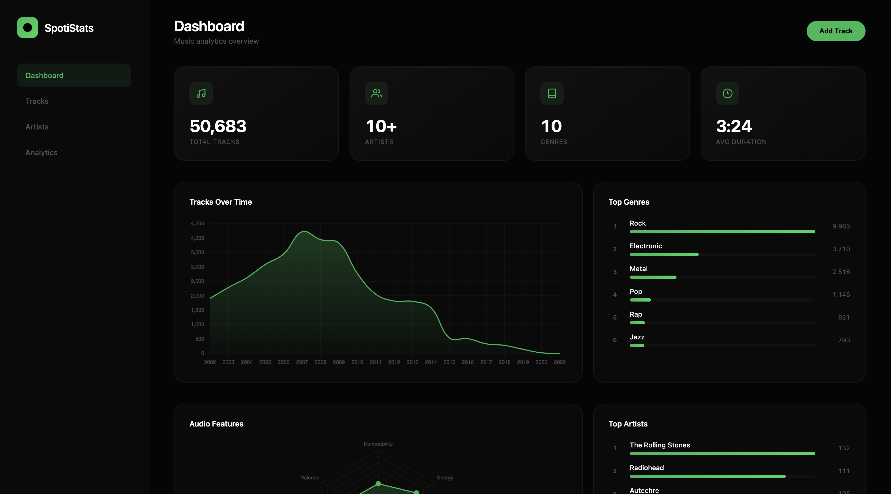
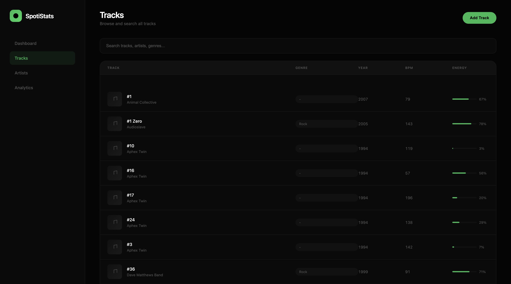
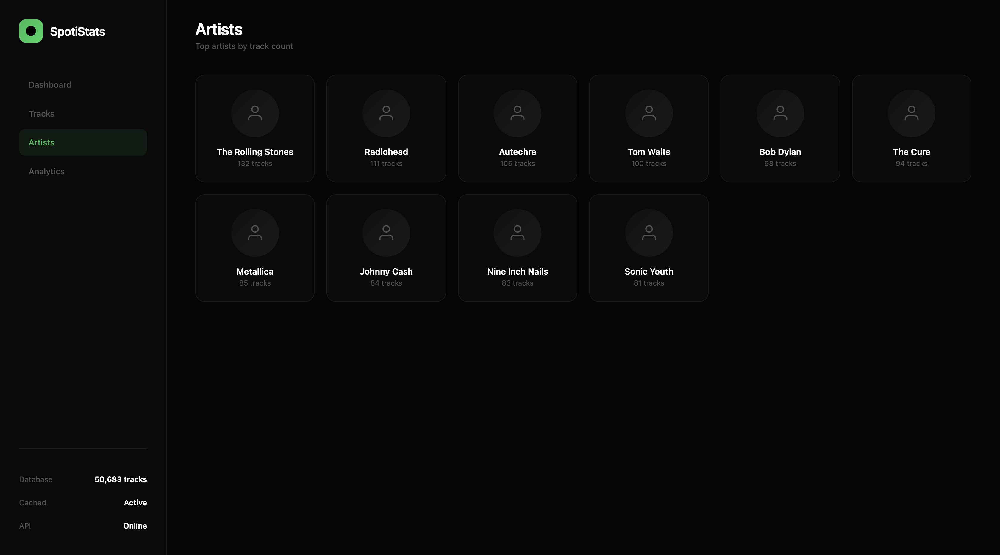
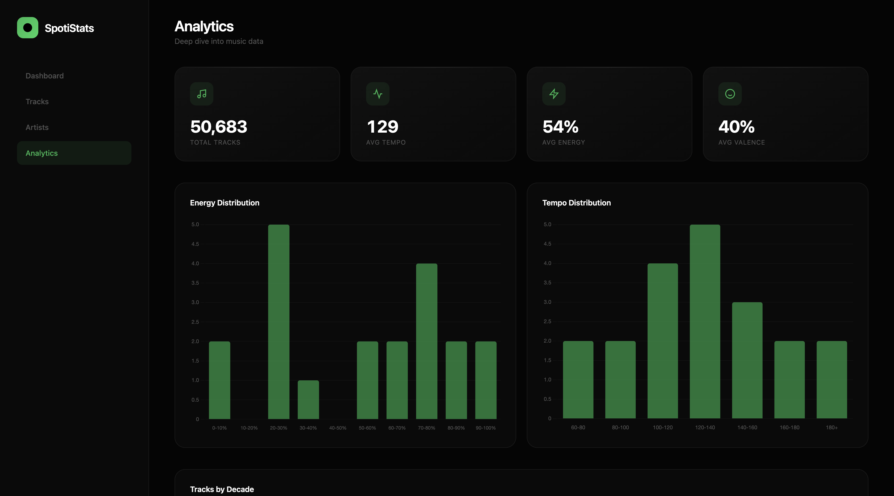

# SpotiStats

A music analytics backend built with Go, featuring a real-time dashboard for exploring 50k Spotify tracks.

## Screenshots

### Dashboard


### Tracks


### Artists


### Analytics


## Features

- 50k Spotify tracks dataset
- Real-time analytics dashboard
- Search and filter tracks
- Genre, artist, year statistics
- Redis caching for fast lookups
- Swagger API documentation

## Tech Stack

| Component | Technology |
|-----------|------------|
| API | Go + Echo |
| Database | PostgreSQL |
| Cache | Redis |
| Docs | Swagger |
| Frontend | Vanilla JS + Chart.js |

## Quick Start
```bash
# Clone
git clone https://github.com/fuzztobread/spotistats.git
cd spotistats

# Setup env
cp .env.example .env
# Edit .env and set DB_PASSWORD

# Run (auto migrates and seeds on first run)
docker compose up --build -d

# Open dashboard
open http://localhost:8080

# API docs
open http://localhost:8080/swagger/index.html
```

## API Endpoints

| Method | Path | Description |
|--------|------|-------------|
| GET | `/` | Dashboard |
| GET | `/health` | Health check |
| GET | `/tracks` | List tracks (paginated) |
| GET | `/tracks/:id` | Get single track |
| POST | `/tracks` | Add new track |
| GET | `/stats/genres` | Top genres |
| GET | `/stats/artists` | Top artists |
| GET | `/stats/years` | Tracks by year |
| GET | `/swagger/*` | API documentation |

## Query Parameters

### GET /tracks

| Param | Type | Description |
|-------|------|-------------|
| page | int | Page number (default: 1) |
| limit | int | Items per page (default: 20, max: 100) |
| q | string | Search by track name |
| genre | string | Filter by genre |
| artist | string | Filter by artist |

Example:
```bash
curl "http://localhost:8080/tracks?page=1&limit=10&genre=rock"
```

## Project Structure
```
spotistats/
├── cmd/
│   └── spotistats/
│       ├── main.go
│       └── commands/
│           ├── root.go
│           ├── serve.go
│           ├── migrate.go
│           └── seed.go
├── internal/
│   ├── cache/         # Redis client
│   ├── config/        # Environment config
│   ├── database/      # Postgres connection
│   ├── handlers/      # HTTP handlers
│   ├── loader/        # CSV loader
│   ├── models/        # Data models
│   └── repository/    # Database queries
├── web/
│   └── static/        # Dashboard HTML
├── data/
│   └── tracks.csv     # Dataset
├── scripts/
│   └── start.sh       # Startup script
├── docs/
│   └── screenshots/   # UI screenshots
├── docker-compose.yml
├── Dockerfile
└── README.md
```

## CLI Commands
```bash
# Start server
./spotistats serve

# Run migrations
./spotistats migrate

# Seed database
./spotistats seed -f data/tracks.csv
```

## Local Development
```bash
# Start dependencies
docker compose up postgres redis -d

# Create .env.local
cat > .env.local << EOF
DB_HOST=localhost
DB_PORT=5432
DB_USER=spotistats
DB_PASSWORD=your_password
DB_NAME=spotistats
REDIS_ADDR=localhost:6379
PORT=8080
EOF

# Run locally
go run cmd/spotistats/main.go serve
```

## Environment Variables

| Variable | Description |
|----------|-------------|
| DB_HOST | Postgres host |
| DB_PORT | Postgres port |
| DB_USER | Postgres user |
| DB_PASSWORD | Postgres password |
| DB_NAME | Database name |
| REDIS_ADDR | Redis address |
| PORT | Server port |

## Dataset

The dataset contains 50k Spotify tracks with:

- Track ID, name, artist
- Genre, year, duration
- Audio features (tempo, energy, danceability, etc.)
- Spotify preview URL

## License

MIT
